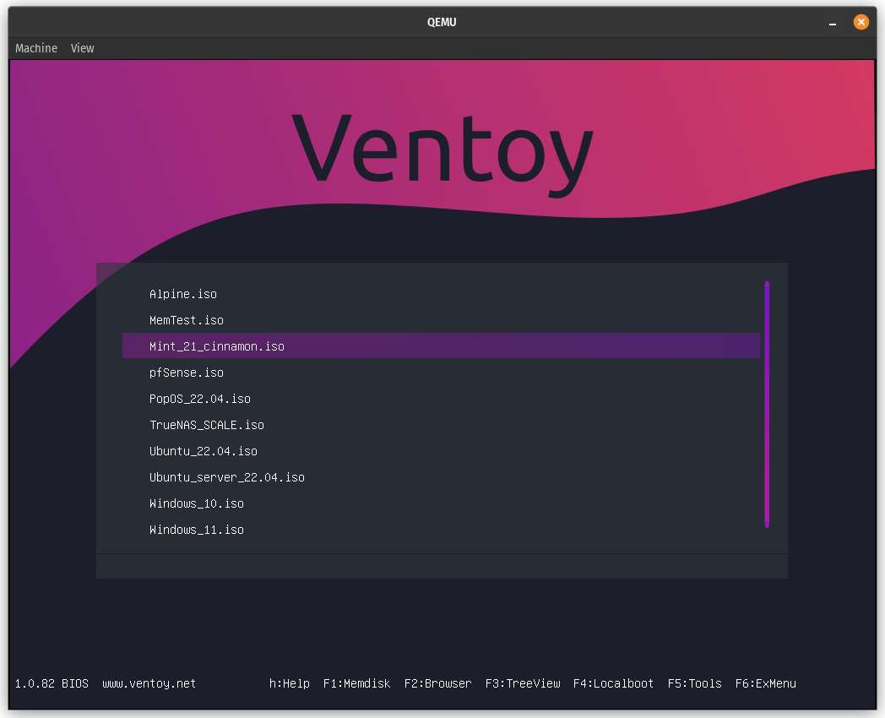

 
<h1 align="center">Ventoy Purple Theme </h1>
<h6 align="center">Just a purple theme for Ventoy Multiboot.</h6>

 
  

  

 

### Install . . .

[PT-BR]
- Extraia o arquivo compactado e copie a pasta "ventoy" para a raiz da partição onde estão seus ISOs.

[ENG]
- Extract the compressed file and copy the "ventoy" folder to the root of the partition where your ISOs are located.

 

### Links

- [Ventoy Website](https://www.ventoy.net)

  
